# NLWeb State Machine Diagram

全面性系統狀態圖，涵蓋從連接建立到響應完成的完整生命週期。

---

## 1. 系統總覽 (Top-Level Overview)

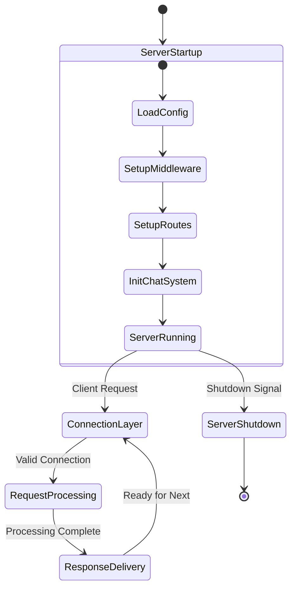

---

## 2. 連接層狀態 (Connection Layer)

### 2.1 HTTP 連接

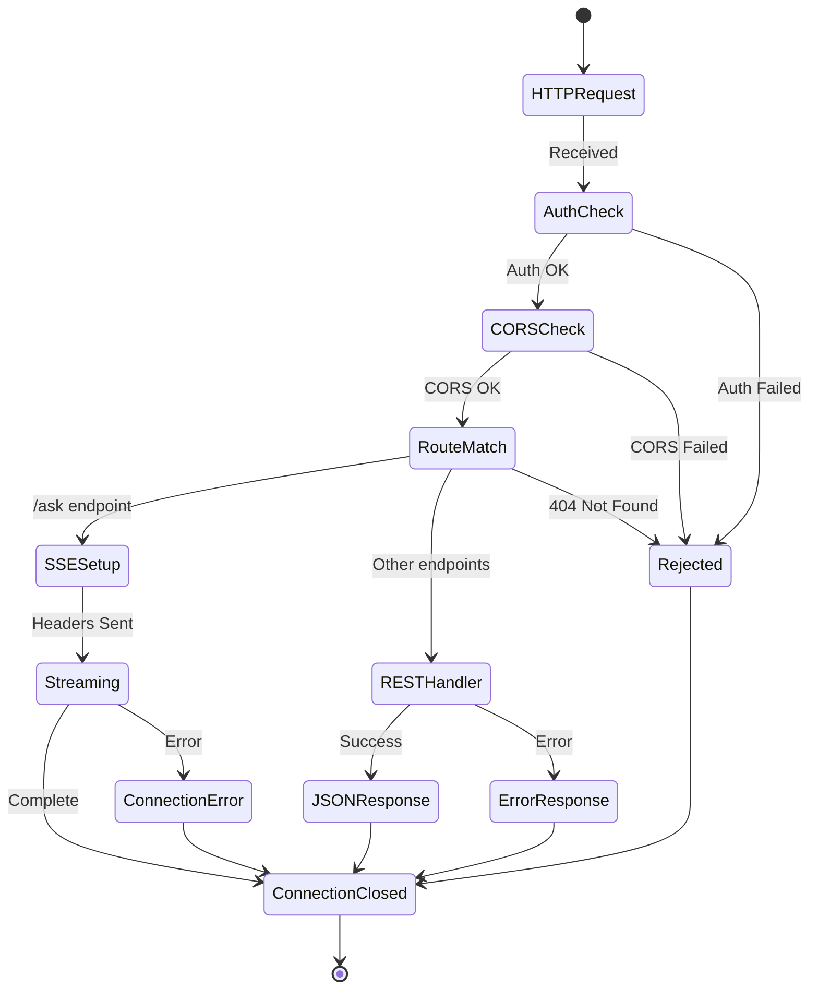

### 2.2 WebSocket 連接

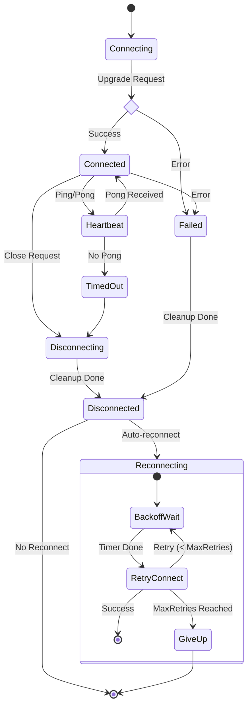

---

## 3. 請求處理狀態 (Request Processing - NLWebHandler)

```mermaid
stateDiagram-v2
    [*] --> HandlerInit

    state HandlerInit {
        [*] --> InitCoreParams
        InitCoreParams --> InitQueryContext
        InitQueryContext --> InitConversation
        InitConversation --> InitState
        InitState --> InitSync
        InitSync --> InitMessaging
        InitMessaging --> [*]
    }

    HandlerInit --> SendBeginResponse
    SendBeginResponse --> Prepare

    state Prepare {
        [*] --> ParallelPreChecks

        state ParallelPreChecks {
            state fork_prechecks <<fork>>
            state join_prechecks <<join>>

            [*] --> fork_prechecks
            fork_prechecks --> Decontextualize
            fork_prechecks --> QueryRewrite
            fork_prechecks --> TimeRangeExtract
            fork_prechecks --> ToolSelection
            fork_prechecks --> Memory

            Decontextualize --> join_prechecks
            QueryRewrite --> join_prechecks
            TimeRangeExtract --> join_prechecks
            ToolSelection --> join_prechecks
            Memory --> join_prechecks

            join_prechecks --> [*]
        }

        ParallelPreChecks --> PreChecksDone
        PreChecksDone --> Retrieval

        state Retrieval {
            [*] --> CheckSiteSupport
            CheckSiteSupport --> SkipRetrieval: No Embeddings
            CheckSiteSupport --> VectorSearch: Has Embeddings

            VectorSearch --> TemporalFilter: Is Temporal Query
            VectorSearch --> SetResults: Not Temporal
            TemporalFilter --> SetResults
            SkipRetrieval --> SetResults

            SetResults --> [*]
        }

        Retrieval --> [*]
    }

    Prepare --> QueryDoneCheck

    state QueryDoneCheck <<choice>>
    QueryDoneCheck --> SendEndResponse: query_done = true
    QueryDoneCheck --> RouteQuery: query_done = false

    state RouteQuery {
        [*] --> CheckToolResults
        CheckToolResults --> ToolHandler: Has Handler Class
        CheckToolResults --> RankingPipeline: No Handler / Search Tool

        ToolHandler --> [*]
        RankingPipeline --> [*]
    }

    RouteQuery --> PostRanking

    state PostRanking {
        [*] --> CheckMapMessage
        CheckMapMessage --> CheckGenerateMode

        state CheckGenerateMode <<choice>>
        CheckGenerateMode --> Done: mode = none
        CheckGenerateMode --> Summarize: mode = summarize

        Summarize --> Done
        Done --> [*]
    }

    PostRanking --> CacheResults
    CacheResults --> SendEndResponse
    SendEndResponse --> [*]
```

---

## 4. 排序管道狀態 (Ranking Pipeline)

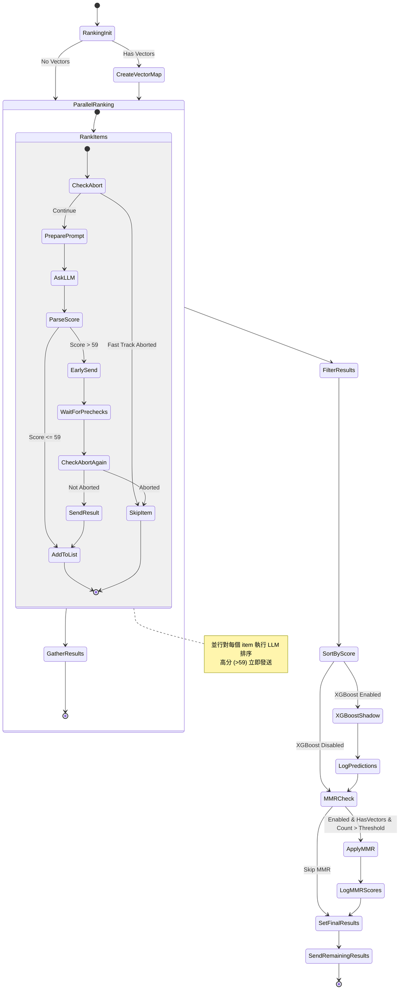

---

## 5. Reasoning 系統狀態 (Deep Research)

### 5.1 Deep Research Handler

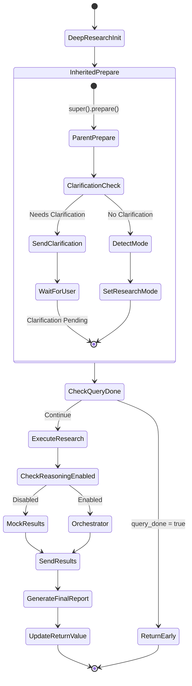

### 5.2 Actor-Critic Loop (Orchestrator)

```mermaid
stateDiagram-v2
    [*] --> SetupSession

    SetupSession --> FilterSources

    state FilterSources <<choice>>
    FilterSources --> NoSourcesError: No Sources After Filter
    FilterSources --> FormatContext: Has Sources

    NoSourcesError --> [*]: Error Response

    FormatContext --> ActorCriticLoop

    state ActorCriticLoop {
        [*] --> IterationStart

        IterationStart --> AnalystPhase

        state AnalystPhase {
            [*] --> CheckPreviousReview

            state CheckPreviousReview <<choice>>
            CheckPreviousReview --> AnalystRevise: REJECT
            CheckPreviousReview --> AnalystResearch: First / PASS

            AnalystResearch --> CheckGapDetection
            AnalystRevise --> CheckGapDetection

            state CheckGapDetection <<choice>>
            CheckGapDetection --> GapSearch: SEARCH_REQUIRED
            CheckGapDetection --> ProcessGapResolutions: Has gap_resolutions
            CheckGapDetection --> AnalystComplete: No Gaps

            state GapSearch {
                [*] --> ExecuteSecondarySearch
                ExecuteSecondarySearch --> MergeResults: Has Results
                ExecuteSecondarySearch --> AddSystemHint: No Results
                MergeResults --> ReformatContext
                ReformatContext --> [*]
                AddSystemHint --> [*]
            }

            GapSearch --> AnalystComplete

            state ProcessGapResolutions {
                [*] --> ClassifyGaps

                ClassifyGaps --> LLMKnowledge: llm_knowledge
                ClassifyGaps --> WebSearch: web_search
                ClassifyGaps --> StockTW: stock_tw
                ClassifyGaps --> StockGlobal: stock_global
                ClassifyGaps --> Wikipedia: wikipedia
                ClassifyGaps --> WeatherAPIs: weather_*
                ClassifyGaps --> CompanyAPIs: company_*

                LLMKnowledge --> AddToContext
                WebSearch --> AddToContext
                StockTW --> AddToContext
                StockGlobal --> AddToContext
                Wikipedia --> AddToContext
                WeatherAPIs --> AddToContext
                CompanyAPIs --> AddToContext

                AddToContext --> CheckNewData

                state CheckNewData <<choice>>
                CheckNewData --> RerunAnalyst: Data Added
                CheckNewData --> [*]: No New Data

                RerunAnalyst --> [*]
            }

            ProcessGapResolutions --> AnalystComplete
            AnalystComplete --> [*]
        }

        AnalystPhase --> CriticPhase

        state CriticPhase {
            [*] --> ReviewDraft
            ReviewDraft --> EvaluateLogic
            EvaluateLogic --> CheckSources
            CheckSources --> DetermineStatus
            DetermineStatus --> [*]
        }

        CriticPhase --> ConvergenceCheck

        state ConvergenceCheck <<choice>>
        ConvergenceCheck --> ExitLoop: PASS or WARN
        ConvergenceCheck --> NextIteration: REJECT & iterations < max
        ConvergenceCheck --> GracefulDegradation: REJECT & iterations >= max

        NextIteration --> IterationStart
        GracefulDegradation --> ExitLoop
        ExitLoop --> [*]
    }

    ActorCriticLoop --> WriterPhase

    state WriterPhase {
        [*] --> CheckPlanAndWrite

        state CheckPlanAndWrite <<choice>>
        CheckPlanAndWrite --> PlanPhase: Enabled
        CheckPlanAndWrite --> ComposePhase: Disabled

        PlanPhase --> CreateOutline
        CreateOutline --> ComposePhase

        ComposePhase --> GenerateFinalReport
        GenerateFinalReport --> [*]
    }

    WriterPhase --> HallucinationGuard

    state HallucinationGuard {
        [*] --> VerifySources

        state VerifySources <<choice>>
        VerifySources --> PassGuard: Sources Valid
        VerifySources --> CorrectSources: Invalid Sources

        CorrectSources --> PassGuard
        PassGuard --> [*]
    }

    HallucinationGuard --> FormatResult
    FormatResult --> [*]
```

---

## 6. Chat 系統狀態 (Conversation Management)

### 6.1 WebSocket Manager

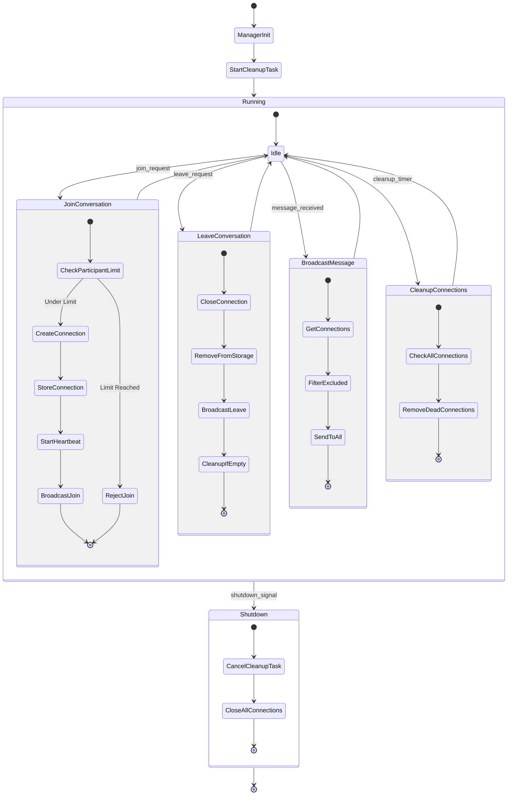

### 6.2 Conversation Manager

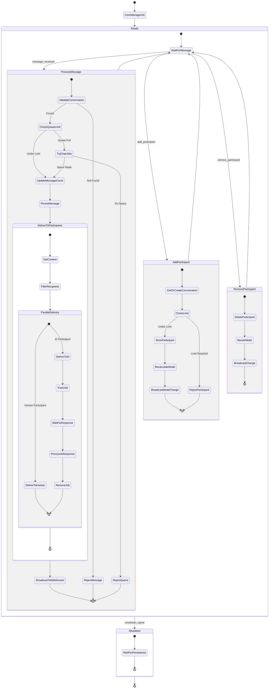

---

## 7. SSE 串流狀態 (Response Streaming)

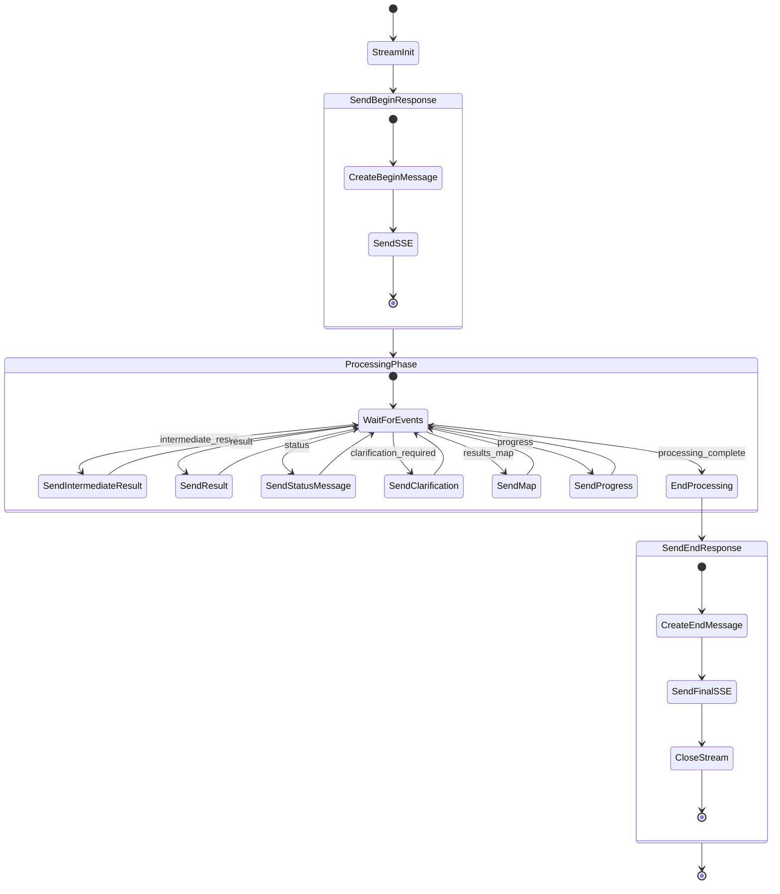

---

## 8. 錯誤處理狀態 (Error Handling)

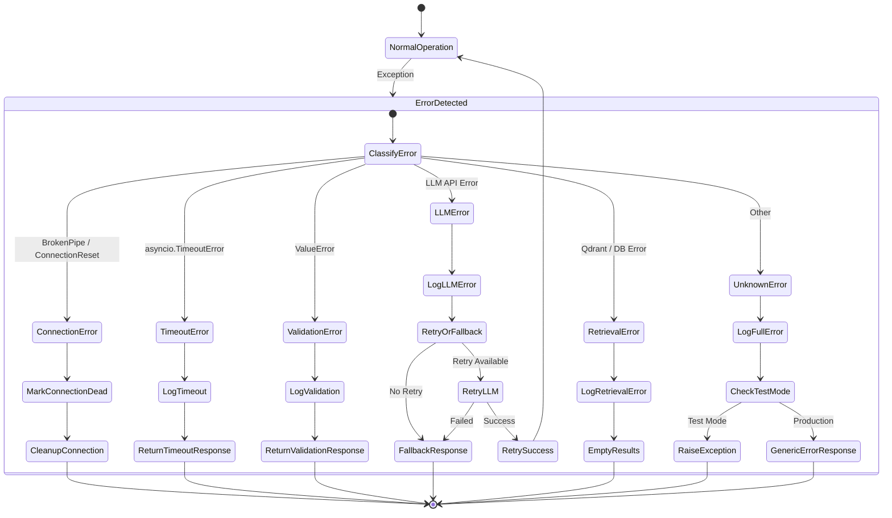

---

## 9. Handler State (NLWebHandlerState)

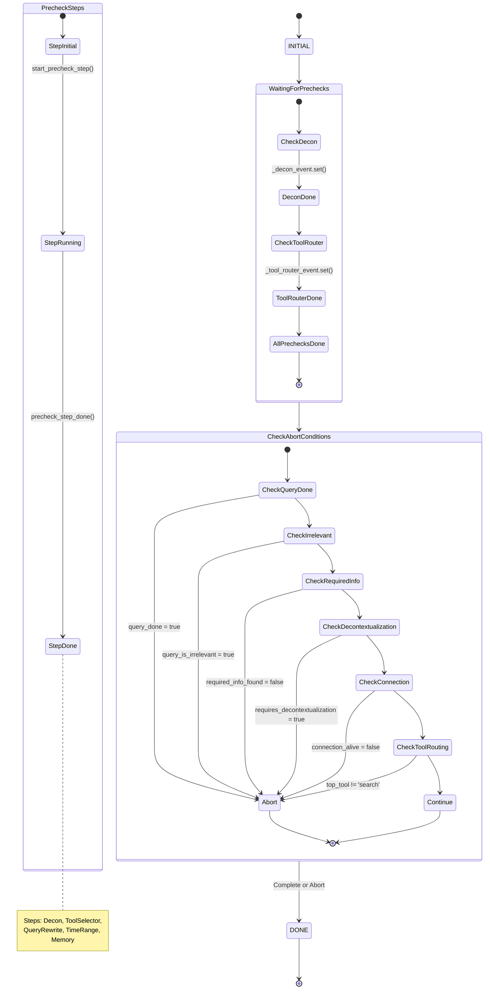

---

## 10. 完整生命週期 (Full Request Lifecycle)

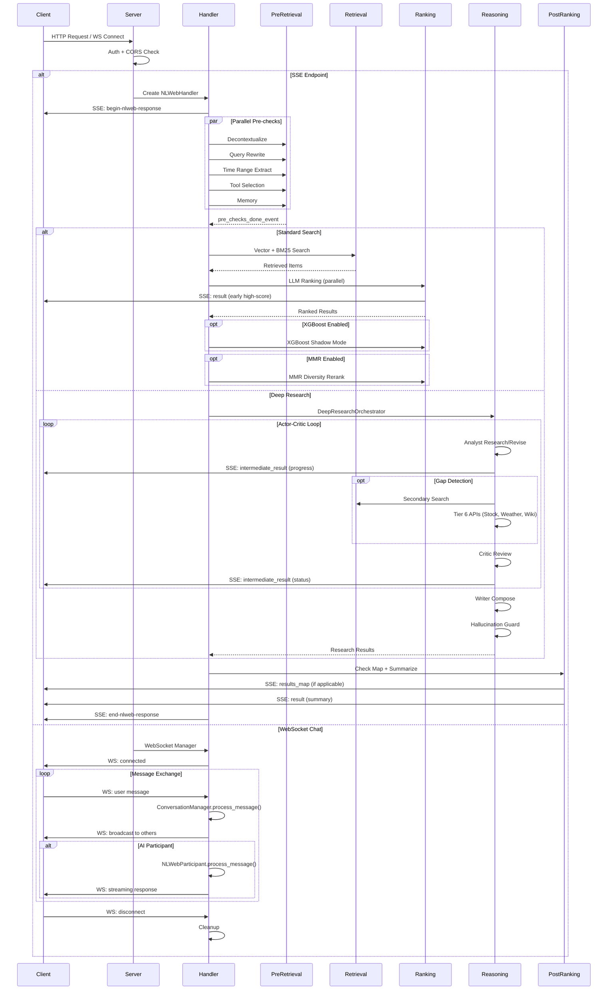

---

## 圖例說明

| 符號 | 意義 |
|------|------|
| `[*]` | 初始/終止狀態 |
| `<<choice>>` | 條件分支 |
| `<<fork>>` / `<<join>>` | 並行分叉/合流 |
| `state Name { }` | 複合狀態 |
| `-->` | 狀態轉換 |
| `-->>` | 非同步回應 |

---

## 關鍵檔案對應

| 狀態區域 | 主要檔案 |
|----------|----------|
| Server Startup | `webserver/aiohttp_server.py` |
| Connection Layer | `webserver/middleware/`, `chat/websocket.py` |
| Request Processing | `core/baseHandler.py`, `core/state.py` |
| Pre-Retrieval | `core/query_analysis/*.py` |
| Retrieval | `core/retriever.py`, `core/bm25.py` |
| Ranking | `core/ranking.py`, `core/xgboost_ranker.py`, `core/mmr.py` |
| Reasoning | `reasoning/orchestrator.py`, `reasoning/agents/*.py` |
| Post-Ranking | `core/post_ranking.py` |
| Chat | `chat/conversation.py`, `chat/websocket.py` |
| SSE Streaming | `core/utils/message_senders.py`, `core/schemas.py` |

---

*Generated: 2026-01-14*
